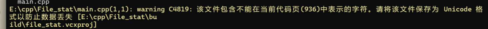
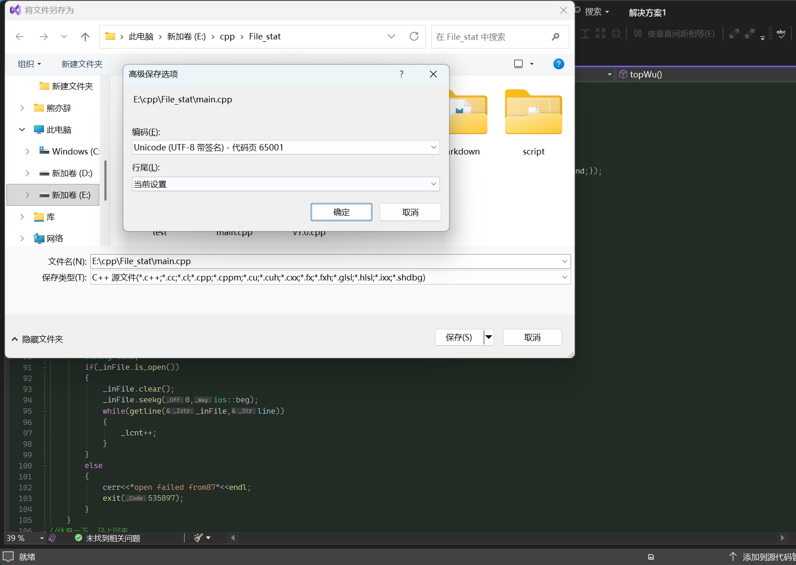

# 项目名称: 文件统计工具 #

## 功能特性 ##

- **核心功能 1**: 统计文本字数,包括英语单词和中文字符。
- **核心功能 2**: 总结前五个高频词(仅限英文单词)。
- **核心功能 3**: 可根据高频词生成柱状图。

## 技术栈 ##

| 技术模块 | 核心工具 / 库           | 关键知识点                              |
| -------- | ----------------------- | --------------------------------------- |
| 核心逻辑 | C/C++11 及以上          | 文件读取、字符串分割、基础统计          |
| 数据存储 | 文本文件（.txt）        | 结构化数据写入（如每行一个统计项）      |
| 可视化   | Python 3.x + matplotlib | 读取文本文件、绘制简单柱状图            |
| 构建工具 | CMake 3.10+             | 定义可执行目标、指定 C++ 标准、编译命令 |

## 使用 ##

### 先决条件 ###

- CMake >= 3.10
- C++17 兼容编译器
- Pyhthon 3.x
- Git

### 编译运行 ##

```cmd
# 克隆仓库
git clone https://github.com/bit47/FILE_STAT.git

# 创建构建目录
mkdir build && cd build

# 配置项目
cmake ..

# 编译项目
cmake --build . --config Debug

# 运行项目
chcp 65001
cd Debug
file_stat.exe

#或者指定输入输出文件路径,没有则使用默认路径
file_stat.exe input.txt -o/--output result.txt
```

运行成功后会看到成功输出

```cmd
success
```

生成柱状图则需要进入script文件夹运行plot.py, 生成图片位于test文件夹, 名为top5.png。

## 遇到的问题 ##

### 1. 输出遇到乱码 ###



#### 解决方式 ####

问了dpsk, 用visual studio更改了保存方式(utf-8(带签名)), 并在cmake中更改了控制台编码方式。

```cmake
cmake_minimum_required(VERSION 3.10)
project(FILESTAT CXX)
set(CMAKE_CXX_STANDARD 17)

# 添加UTF-8编译选项
if(MSVC)
    add_compile_options("/utf-8")
endif()

include_directories(include)
add_executable(file_stat main.cpp)
```

二编: 好像没用, 还是乱码, 通过在控制台输入chcp 65001 改变控制台编码方式




